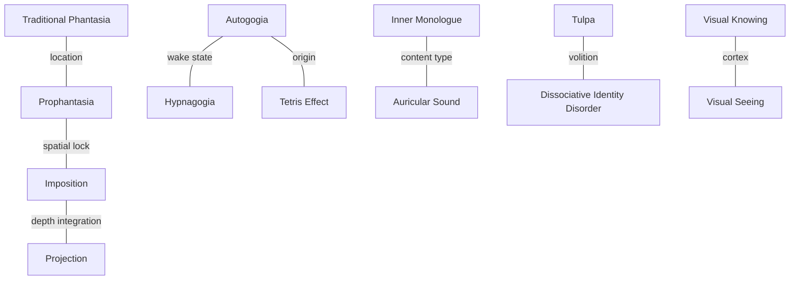

# Comparisons

The CureAphantasia community relies on precise distinctions. Sloppy terminology sends trainees down the wrong path — someone told to "just visualize" when they need to be told "project into the visual field" wastes months. Someone chasing imposition before they have any 3D sight ends up doing mediocre prophantasia and thinking it's broken. The pairs below are the distinctions that come up most often. Each one summarizes what actually separates the two concepts, how they share infrastructure, and where community usage is still unsettled.

----

----

## Core mode pairs

### Traditional Phantasia vs. Prophantasia

The two primary voluntary-visualization modes. The closest cousin pair in the taxonomy — both are trainable, both can reach high vividness, and practitioners routinely alternate between them.

| Axis | Traditional Phantasia | Prophantasia |
|------|----------------------|--------------|
| Where imagery appears | Inside the mind ("mind's eye") | Projected into the visual field |
| Relationship to vision | Non-overlapping with retinal signal | Overlaps with retinal signal |
| Character | "Seeing is thinking" — a thought mode | "Seeing at thoughts" — a perceptual mode |
| Typical substrate | Sensory thinking in memory | Palinopsia and afterimages extended |
| Onramp drill | Memory recall, memory palace | Flash technique, afterimage chains |
| Failure mode | Fragmentation, tunnel vision, verbal interference | Eye artifacts masquerading as mental ones; visual snow |

• **Shared infrastructure** - Both rely on sensory thinking. Both improve with mental-gaze decoupling from ocular gaze. Both are trainable from an aphantasia or hypophantasia baseline.

• **Why practitioners alternate** - Stagnation in one mode often unblocks with a switch to the other. The modes exercise partially different neural resources; success in prophantasia can demonstrate "imagery is possible" in a way that unblocks traditional phantasia effort; traditional phantasia builds the bandwidth and persistence foundation that prophantasia needs.

• **Capability can develop unevenly** - One reference case can project full-color scenes via prophantasia but struggles to visualize arbitrary numbers via traditional phantasia. _The modes appear to specialize on different content types, but the mechanism for this split is not yet understood._

----

### Prophantasia vs. Imposition

Both project mental imagery into the visual field. The distinction is geometric — how the projected content relates to the 3D scene around you.

| Axis | Prophantasia | Imposition |
|------|--------------|------------|
| Spatial lock | Viewer-locked (moves with head/gaze) | Scene-locked (stays in its scene location) |
| Depth integration | Often 2D / HUD-like | 3D — respects scene geometry |
| Occlusion | Imagery overlays regardless of foreground | Imagery can be occluded by physical objects |
| Use case | On-demand symbols, sketches, overlays | Tangible entities (e.g. tulpas), scene additions |
| Training order | Earlier — built on palinopsia | Later — built on prophantasia plus 3D sight |

• **Why imposition is typically later** - Imposition requires a depth substrate for the imposed object to live in. Practitioners who haven't cultivated 3D sight often report imposed objects "floating" incorrectly — they are really doing prophantasia with extra effort. Training 3D sight first gives imposition a scene to embed into.

• **Terminology unsettled** - _The community flags this boundary as fuzzy._ "Warping" and "projecting" are proposed alternatives. Imposed objects that fail to integrate (bad lighting, wrong scale, no occlusion) are sometimes treated as sub-par prophantasia rather than failed imposition.

• **Tulpa context** - Tulpa practice draws the distinction sharpest: a tulpa that is projected is not the same as a tulpa that is _there_. Imposition is the latter; mere prophantasia of a tulpa is the former. Most tulpamancers reach interactive conversation long before imposition.

----

### Imposition vs. Projection

The two named mental processes for placing imagery into or onto the visual field. _This terminology is explicitly unsettled — the boundary below reflects rough community convention rather than fixed usage._

| Axis | Projection | Imposition |
|------|------------|------------|
| Spatial relationship | Overlay on visual field | Embedded in 3D scene |
| Viewer-locked? | Yes — moves with head and gaze | No — stays in scene location |
| Respects depth? | Often no | Yes — occlusion, lighting, scale |
| Typical stage | Earlier (prophantasia baseline) | Later (prophantasia plus 3D depth) |
| Prerequisite | Palinopsia / afterimage chain | Projection plus 3D sight |

• **Terminology caveat** - Some practitioners use "projection" as the general term and "imposition" as the specific 3D-integrated variant. Others treat them as parallel terms with different targets. _Usage is non-standard across sources._

• **Open questions the community hasn't settled** - Is projection strictly 2D, or can it be 3D-but-viewer-locked (HUD-with-depth)? Does imposition require conscious depth calibration or emerge automatically once projection is fluent? Are there distinct neural substrates, or is imposition just projection running with better scene modeling?

----

### Autogogia vs. Hypnagogia

Both sit on the involuntary-imagery spectrum, share perceptual space, and use overlapping neural substrates. The distinction is state-of-consciousness.

| Axis | Autogogia | Hypnagogia |
|------|-----------|------------|
| Conscious state | Fully awake | Sleep-threshold |
| Control | Trainable; controllable once stabilized | Involuntary; fragile |
| Access requirement | Relaxed waking state; 15+ min setup | Proximity to sleep |
| Vividness | Builds with practice from noise to scenes | Often already vivid |
| Duration | Sustainable across a session | Brief; collapses on excitement |

• **Community debate** - Two positions appear in the corpus. _"Hypnagogia is simply subconscious autogogia"_ — same mechanism, different wake state. _"Hypnagogia is a subset of autogogia"_ — the sleep-onset variant of the same broader phenomenon. Either way, training one sharpens access to the other.

• **Shared perceptual space** - Both appear on the same "screen" — between closed eyelids and baseline visual noise, distinct from the mind's eye of traditional phantasia and the projected space of prophantasia. Tetris effect imagery also occupies this screen.

• **Shared neural correlates** - Theta and alpha states. PFC-limbic dysregulation. Visual cortex activity with external input gated. Similar to dreaming.

----

### Autogogia vs. Tetris Effect

Both appear on the same perceptual screen behind closed eyelids, distinct from the mind's eye. The difference is origin and control trajectory.

| Axis | Autogogia | Tetris Effect |
|------|-----------|---------------|
| Origin | Induced via sensory thinking and relaxation | Produced by prolonged repetitive exposure |
| Content | Open — whatever the practitioner attends to | Specific — replays of the inducing stimulus |
| Control | Trainable from the start | Initially involuntary; controllable via meditation |
| Typical duration | Minutes, extendable | Days after the exposure |

• **Use as onramp** - Tetris effect imagery can serve as a training scaffold for voluntary autogogia. Practitioners meditate on the intrusion, attempt to modify it, and thereby learn to steer imagery on the autogogic screen. The transition from "watching involuntary replay" to "modifying replay" _is_ the transition to voluntary autogogia.

• **Conceptual pairing** - Some community voices treat tetris effect as involuntary autogogia driven by specific recent stimulus, analogous to how hypnagogia is sometimes framed as "subconscious autogogia." _Under that framing, all three phenomena — autogogia, tetris effect, hypnagogia — are variants of the same process at different levels of voluntariness._

----

## Mechanism distinctions

### Inner Monologue vs. Auricular Sound

Both involve "hearing" something mentally. The distinction is propositional versus sensorial.

| Axis | Inner Monologue | Auricular Sound |
|------|-----------------|-----------------|
| What is heard | Words carrying meaning | Sound as a sonic object |
| Thinking style | Verbal thinking | Sensory thinking |
| Mechanism | Mental facility for verbal reasoning | Auditory analogue of the mind's eye |
| Can carry semantic content? | Primary purpose | Only if the sound is linguistic |
| Can be "voiceless"? | Yes — pure verbal thought without timbre | No — sound requires acoustic properties |

• **Synergy** - Inner monologue _can_ use auricular sound to attach voice properties (timbre, pitch, prosody) to its words. A "voiced" inner monologue is the composite; a "voiceless" inner monologue is pure verbal reasoning stripped of sonic content.

• **Interference** - Over-active inner monologue competes with auditory imagination for bandwidth. Training auditory prophantasia often begins with learning to _stop_ inner narration of sounds — holding the sound without describing it, the auditory parallel to the visual injunction against labeling.

• **Training implications** - An aphant with strong inner monologue often finds auricular sound easier than visual modes — the auditory channel is already partially open. An aphant without inner monologue may find both harder initially — the verbal substrate is thin. Tulpa practice exploits parallel inner-monologue instances ("inner dialogue") as voice-distinct parallel channels.

----

### Tulpa vs. Dissociative Identity Disorder

An explicit community distinction. Both involve multiple identity-loci within one mind, but the origin, phenomenology, and control differ sharply.

| Axis | Tulpa | DID |
|------|-------|-----|
| Origin | Intentional, deliberate construction | Trauma-based; non-volitional |
| Awareness | Practitioner always aware of tulpa | Identity switches often unconscious; amnesia between |
| Switch mechanism | Perspective shift (like an optical illusion flip) | Dissociative switch; often externally triggered |
| Interactive | Continuous dialogue; collaborative | Often siloed; limited inter-alter communication |
| Pathology | None — cognitive skill | Clinical disorder requiring treatment |
| Memory continuity | Usually continuous; may share memory | Often broken; alters may hold distinct memories |

• **Shared mechanism** - Both likely tap dissociation substrates in the neutral sense — the brain's capacity to host semi-separate processing threads. _The community is explicit that tulpa practice leverages this capacity intentionally and healthily, contra the pathological DID analog._

• **Not the same as hallucination** - A tulpa is not a perceived external entity in the hallucination sense. Even imposed tulpas are distinguishable from hallucinations by the practitioner: they are known to be constructed, and the construction is under ongoing volitional control.

• **Why this distinction is made defensively** - External observers often conflate the two. The community stance is pragmatic — tulpa is a cognitive skill like any other thinking-style variation.

----

## Thinking distinctions

### Visual Knowing vs. Visual Seeing

A distinction the community returns to constantly. Many aphants can _know_ what an apple looks like — color, shape, typical stem — without _seeing_ an apple mentally. These are different cognitive operations, and conflating them is the first wall most trainees hit.

| Axis | Visual Knowing | Visual Seeing |
|------|----------------|---------------|
| Thinking style | Conceptual thinking / analogue | Sensory thinking |
| Content | Propositional — facts about appearance | Sensorial — actual visual content |
| Requires visual cortex activation? | No | Yes |
| Can answer "what color?" | Yes — "red" | Yes, but _by inspecting the mental image_ |
| Feels like | Retrieval of a description | Perception |

• **Why the confusion is common** - In normal speech the two collapse. Aphants describing their experience often say "I can visualize it" when they mean "I know what it looks like," which leads to mutual miscommunication. Part of early training is learning to _notice_ the difference, and this noticing is often the first concrete milestone.

• **Practical tell** - Ask "what color is the apple?" Both knowers and seers can answer red. Then ask "is the apple's shine on the left or the right?" Knowers either make something up or acknowledge they don't know; seers _look_ at the apple and report.

• **Training implication** - Visualization training is largely _rerouting_ the apple-question from the knowing channel to the seeing channel. This is why community methods emphasize descriptions that require inspection (value, saturation, shadow) rather than labels (red apple).

----
