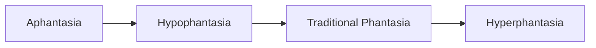
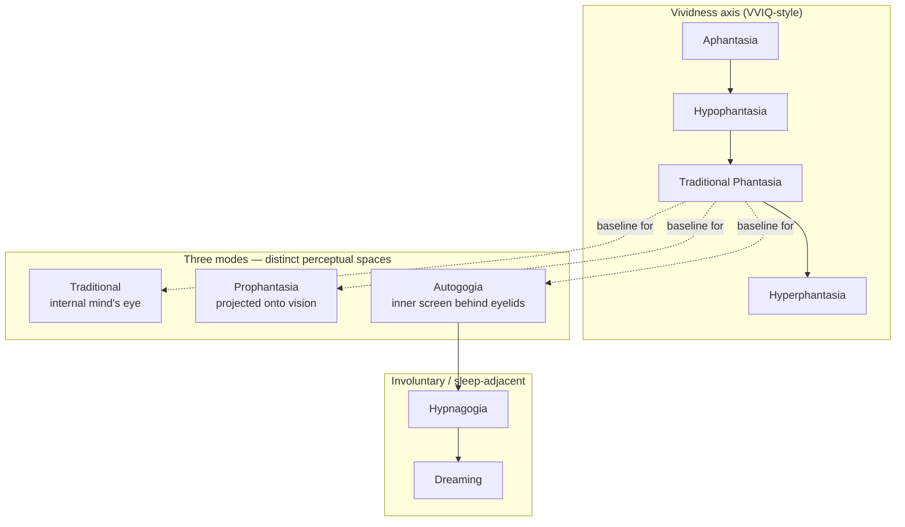
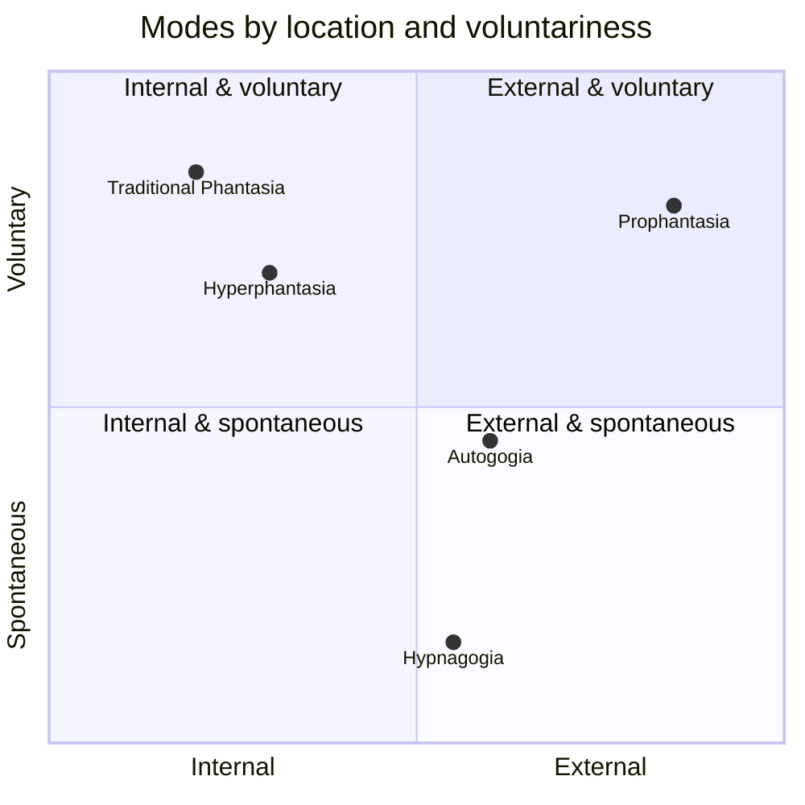

# Phantasia Spectrum

The phantasia spectrum is how this community talks about differences in visual mental imagery. On the vividness axis, people range from no voluntary imagery at all through faint and fragmented imagery, stable "normal" imagery, and up to imagery more vivid than real perception. The VVIQ (Vividness of Visual Imagery Questionnaire) is the usual self-report instrument, but it is a crude tool — it captures one axis of a much richer experience and relies entirely on honest introspection.

Vividness is not the whole story. Traditional phantasia, prophantasia, and autogogia are better understood as three distinct **modes** of imagery — different ways the same underlying capacity can be generated and located — rather than points on one linear scale. A person can be strong in one mode and weak in another. Keep that in mind as you read.

----

## Aphantasia

• **Aphantasia** - The inability to generate voluntary visual mental imagery. Can be congenital or acquired. In this community it is treated as a _trainable_ condition — which is a deliberate contrast with the identity-neutral framing used elsewhere.

• **Phenomenology** - No voluntary imagery when eyes are closed. Inner life is typically carried by verbal thinking and conceptual (analogue) thinking only. Dreams may or may not contain imagery — some aphants dream visually despite waking aphantasia.

• **Exit threshold** - The community heuristic is that being able to visually count 1–10 is the practical test separating aphantasia from hypophantasia.

• **SDAM co-occurrence** - _Severely Deficient Autobiographical Memory often co-occurs with aphantasia. The relationship is correlational, not required — many aphants have normal autobiographical recall, and the directionality is unsettled._

• **Possible mechanisms** - _Discussed in the community: genetic predisposition (RCCX / CYP21A2 associations), nutritional deficiency (B1/B12), acquired via trauma or protective suppression of intrusive imagery, and functional dissociation from sensory processing channels. None of these are confirmed causes._

• **Learning implications** - The core training path is inducing sensory thinking, typically starting with simple shapes and colors and memory-based recall. Progress tends to be non-linear — bandwidth (how many properties can be held at once) often expands before vividness.

----

## Hypophantasia

• **Hypophantasia** - Intermediate visualization. Past aphantasia but below traditional phantasia. Imagery is weak, fragmented, low-contrast, and heavily blended with background "black noise."

• **Undefined visual blobs** - Amorphous colored areas without clear form.

• **Color flooding** - Filling mental space with a single saturated color is typically easier than producing defined shapes.

• **Afterimages from recall** - Focusing on recalled imagery produces faint mental afterimages — a signature marker of transition out of aphantasia.

• **Periphery issue** - Imagery often appears off to the side or blurred centrally, requiring deliberate effort to pull it front-and-center.

• **Verbal interference** - Easily disrupted by verbal thinking; inner speech pulls attention out of the visual channel.

• **Training notes** - Color training tends to precede shape retention (one can recall an apple's red before its form). Sensory recall — look, turn away, reconstruct — is most effective early. _Vividness is only one axis; focus, completeness, verbal-interference resistance, and spatial coherence all develop somewhat independently._

----

## Traditional Phantasia

• **Traditional Phantasia ("tradphan")** - Internal visualization. Visual thinking _about_ imagery in the mind's eye, without it overlapping with actual vision. Framed in-community as "seeing is thinking" — a form of sensory thinking distinct from verbal thinking.

• **Mental gaze** - Attention inside the mind's eye, decoupled from where the physical eyes are pointing.

• **Bandwidth** - How many visual properties (color, shape, motion, depth) can be held simultaneously. Expands independently of vividness.

• **Persistence** - How long an image holds. Lengthens through full-scene exploration rather than isolated-object drills.

• **Fragmentation / tunnel vision** - Early-stage issues — small visible patches, kaleidoscopic instability. Addressed by consolidation and gradual scope expansion.

• **Training notes** - Eye closure is not required; many practitioners do better with eyes open. Alpha and theta brain states (tiredness, relaxation) accelerate progress. Scene-exploration beats single-object focus — mentally walking a familiar house room by room tends to outperform staring at an imagined apple. Alternating with prophantasia helps break plateaus.

• **Relationship to other modes** - Prophantasia is tradphan projected outward. Autogogia is the involuntary cousin occupying a different perceptual space. Tulpa practice typically assumes a solid tradphan baseline.

----

## Prophantasia

• **Prophantasia ("prophan")** - External visualization. Mental imagery overlaid onto actual vision — "seeing at your thoughts" rather than thinking them internally. Practitioners describe it as the reflection on a window simultaneous with the view through it.

• **Distinction from hallucination** - Requires _control_ to prevent involuntary projection. Distinct from hallucination in that it is commanded and steerable.

• **Palinopsia** - Natural visual persistence (afterimages). The training foundation. Split into **illusory** (retinal fatigue, inverted color) and **photographic** (true-color) subtypes.

• **Negative afterimage** - Inverted colors, brief duration.

• **Positive afterimage** - True color, longer-lasting. Closer to the photographic target.

• **Optic-nerve persistence** - Residual signal used in flash exercises.

• **Imposition** - _An advanced form of prophantasia where imagery integrates with scene geometry rather than overlaying like a HUD. Some practitioners treat imposition as a separate mode; others treat it as prophantasia with sufficient scene-binding. The boundary is unsettled._

• **Flash technique** - Stare at an object for roughly a second, snap the eyes shut to catch the residual signal.

• **Image chaining** - Sequential visualization of linked images builds persistence.

• **Mindfold + tachistoscope** - A blindfold plus controlled light exposure enables afterimage training without inverted-color artifacts.

• **Unconscious visual capture** - Some practitioners report photographic detail containing information they did not consciously notice while looking — raising open questions about what is being captured.

• **Risks** - _Carries small HPPD-like risks (persistent visual snow). Commonly trained in alternation with traditional phantasia to keep grounding in the internal mode._

----

## Hyperphantasia

• **Hyperphantasia** - Visualization at maximal vividness. Imagery as vivid as, or more vivid than, actual perception.

• **Origins** - Some practitioners report crossing into it after extended practice. Others report it as congenital.

• **Ultraphantasia** - _At the top end, community members describe synesthetic phenomena and imagery that rivals VR in detail and immersion. Can be a destination rather than a stable operating mode — sometimes reported as intermittent peaks rather than a permanent state._

• **Related markers** - Rich, color-accurate, persistent dreams; spontaneous vivid autogogia; the ability to hold full 3D scenes in the theater of the mind indefinitely.

----

## Autogogia

Autogogia is listed separately because it is not a point on the vividness axis. It operates in a distinct perceptual space.

• **Autogogia ("awake hypnagogia")** - Visual imagery appearing in the space between the closed eyelids and baseline visual noise. A third mode distinct from both traditional phantasia (internal) and prophantasia (projected into open-eye vision).

• **Inner screen** - The characteristic location: behind the eyelids, in front of the visual field proper. Not imagined in the mind's eye; not overlaid on waking vision.

• **Semi-involuntary** - Imagery auto-generates when the practitioner is relaxed but remains conscious, controllable, and stabilizable once accessed. Sits between conscious prophantasia and unconscious hypnagogia on the control spectrum.

• **Tied to sleep onset but not requiring it** - Strongly facilitated by the same theta/alpha states that precede sleep, but can be induced while fully alert with practice.

• **Progression** - Visual noise (phosphenes, static) → correlated imagery → distinct forms → full, colorful, often 3D first-person scenes.

• **Decoupled gaze** - Requires decoupling mental gaze from ocular gaze — holding a stable inner screen while the eyes move freely.

• **Techniques** - Flickering candle behind eyelids; divided attention between closed-eye visual noise and traditional-phantasia imagery; "drawing induction" (mentally tracing object shapes); eye-motion while holding mental gaze forward; kasina meditation.

• **Image streaming** - _Used by some practitioners as a description/induction method. The community debates whether image streaming is autogogia itself or merely narrates it._

• **Risks** - _Small HPPD-like risk (persistent visual snow) if over-practiced. Similar cautions apply as with prophantasia._

----

## Hypnagogia

• **Hypnagogia** - Vivid spontaneous imagery occurring at the threshold between wakefulness and sleep (hypnagogic on falling asleep; hypnopompic on waking). Involuntary and dependent on proximity to sleep — which is what distinguishes it from the trainable waking mode of autogogia.

• **Intensity spectrum** - Faint fleeting images through vivid scenarios lasting a minute or more.

• **Autonomous transformation** - Imagery shifts on its own. With soft attention, practitioners can observe and sometimes steer the transformation — but the state is fragile and collapses under excitement or hard focus.

• **Auditory hypnagogia** - Pulsing sounds, voices, and other non-visual phenomena co-occur alongside the visual.

• **Triggers** - Forceful eyelid closure while visualizing, interrupted sleep cycles (the WBTB logic — wake back to bed), sleep deprivation, over-blinking, flickering light before sleep onset.

• **Relation to autogogia** - _Autogogia is often described as "awake hypnagogia." The boundary between late-stage autogogia and early hypnagogia is not sharp — it depends on how close to sleep the practitioner is and how much voluntary control remains._

• **Useful demonstration** - A natural proof to aphants that the visual cortex _can_ generate imagery, even when voluntary access is blocked.

Optional framing — positioning the modes on two axes:

----

## Notes on terminology

• **VVIQ limits** - _The VVIQ measures one axis (vividness of internal imagery) and misses mode, bandwidth, persistence, and control. Treat scores as a rough self-report, not a diagnosis._

• **Autogogia vs hypnagogia** - _The line is drawn by proximity to sleep and degree of voluntary control. In practice there is a gradient; late autogogia and early hypnagogia can look identical from the inside._

• **Prophantasia: projection vs imposition** - _"Projection" usually means HUD-style overlay onto vision. "Imposition" means imagery that binds to scene geometry and occludes correctly. Some treat imposition as a separate mode, others as prophantasia grown up. Usage varies._

• **Hyperphantasia as destination vs state** - _Reports differ on whether hyperphantasia is a stable operating mode or a peak experience. Both may be accurate for different people._

• **Trainability** - _The community framing (visualization can be trained from zero) is not universally accepted in aphantasia spaces. This repo and the r/CureAphantasia community assume trainability; other communities treat aphantasia as a stable cognitive style, not a deficit._
