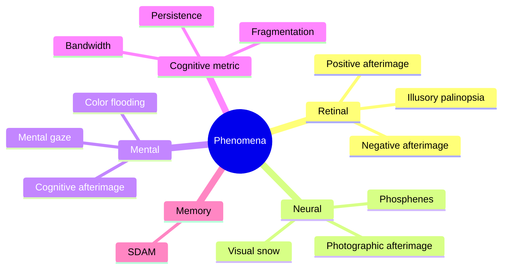

# Phenomena

Phenomena are the observable artifacts of mental imagery — the raw material practitioners actually see, feel, or notice while training. Some are retinal (cone fatigue producing a negative afterimage). Some are neural (phosphenes firing without retinal input; visual snow as a baseline noise floor). Some are purely mental (a cognitive afterimage that holds position when the eyes move). Some are cognitive-behavioral metrics describing the *shape* of the mental image rather than its substrate (bandwidth, persistence, fragmentation).

Distinguishing them matters because training targets different substrates. A drill that extends a cone-fatigue artifact is not the same drill that builds a stable mental scene. A practitioner who cannot tell a phosphene from an imagined shape may mistake baseline neural noise for progress — or mistake genuine mental imagery for "just an afterimage" and dismiss it. The table below is a map from what the community calls these things to where they most likely originate, so the training signal stays clean.

| Phenomenon | Source | Trigger / Context | Notes |
|------------|--------|-------------------|-------|
| Negative afterimage | Retinal (cone fatigue) | Staring at bright / saturated stimulus, then neutral surface | Inverted colors, follows ocular gaze, brief |
| Positive afterimage | Retinal (rod-based) | Brief bright flash, dim follow-through | Monochromatic, true-color, longer than negative |
| Photographic afterimage | _Retinal → mental, debated_ | Extended staring with intent; training-induced | True-color, does not invert; community target for prophantasia |
| Cognitive / mental afterimage | Mental | Revived or placed deliberately after training | Fixed in mental space; does NOT follow eyes |
| Palinopsia (illusory) | Retinal | Cone fatigue, follows eyes | Community-neutral name for the natural afterimage channel |
| Palinopsia (photographic) | _Retinal → mental, debated_ | Practiced staring + revival | Longer-lasting true-color persistence |
| Phosphenes | Neural (visual pathway firing without retinal input) | Closed-eyelid rest, eye pressure, candle-flicker induction | Coherent patterns, color pulses, geometric forms |
| Visual snow | Neural (baseline cortical noise) | Low light, uniform surfaces, or constant baseline | Granular static; can be canvas or nuisance |
| Mental gaze | Mental (attention locus) | Any imagery attempt | Decouplable from ocular gaze; trainable |
| Bandwidth / cardinality | Cognitive metric | Any imagery attempt | Number of properties held simultaneously |
| Persistence | Cognitive metric | Any held image | Duration before fade |
| Fragmentation / tunnel vision / kaleidoscope | Cognitive failure mode | Early-stage visualization attempts | Scope-axis bandwidth deficit |
| Color flooding | Mental (low-bandwidth) | Warm-up, early hypophantasia practice | Single-property task — color without shape |
| SDAM | Memory / cognitive | Autobiographical recall attempts | Frequently co-occurs with aphantasia |

----

## Perceptual residue / afterimages

The afterimage family is the most physical layer of phenomena — signals that start at (or close to) the retina and fade as the hardware recovers. The community distinguishes four subtypes by origin and behavior, and a practical test separates the ocular from the mental. This family is the foundational substrate the community leverages to train prophantasia: the working theory is that the natural afterimage channel can be hijacked, extended, and eventually decoupled from retinal drive entirely.

• **Negative afterimage** – Cone-fatigue artifact. Inverted colors. Brief. Follows ocular gaze. Produced by staring at a bright or saturated stimulus then looking at a neutral surface or closing the eyes. Not the training target — an ocular artifact, not a mental one.

• **Positive afterimage** – Rod-based brightness-scale residue. Monochromatic. True color. Longer-lasting than the negative variant. Produced under specific viewing conditions (brief bright flash, dim follow-through).

• **Photographic afterimage** – True-color persistence that does NOT invert. The community's target state for prophantasia training — an afterimage that behaves like a copy of the original rather than a retinal artifact. Long-lasting. Controllable. _May contain detail the practitioner did not consciously register while looking at the original._

• **Cognitive / mental afterimage** – Fixed in mental space; does NOT follow eye movement. Controllable. Distinguishable from eye artifacts precisely because it remains where the practitioner "placed" it regardless of where the eyes point. The crossover from eye-based to cognitive afterimage is a milestone on the prophantasia arc.

• **Palinopsia** – The neutral community name for the afterimage channel itself. Not used here in its clinical "persistent unwanted afterimage" sense. Split into **illusory palinopsia** (retinal cone-fatigue, follows eyes, typically inverted) and **photographic palinopsia** (true-color persistence, longer-lasting, does not invert, closer to the prophantasia training target). The core prophantasia claim: with training, the palinopsia window — normally under a second — can be extended and the afterimage re-invoked at will rather than requiring a bright stimulus. _The transition from cone-fatigue artifact to mental artifact is debated but noted as possible over long training._

• **Phosphenes** – Light patterns and colors produced by neurons firing in the visual pathway without retinal input. Distinct from afterimages (stimulus-driven) and visual snow (baseline noise). Appear behind closed eyelids as spontaneous patterns, color pulses, or geometric forms. Pressure-induced cases (rubbing eyes) produce brief colored rings or lattices. Relaxed / meditative closed-eye states produce slower, more varied activity. Baseline "canvas" material that autogogia emerges from — practitioners learn to let phosphene activity resolve into correlated shapes. A flickering candle behind closed eyelids is used to drive phosphene activity as a substrate for autogogia induction.

• **Visual snow** – Persistent granular "noise" in the visual field, most visible in low light or against uniform surfaces. Distinct from phosphenes (discrete neural patterns) and afterimages (stimulus residue). _Confidence: medium — the community is divided on whether baseline snow is a bug or a feature for visualization training._ The **feature view** treats snow as raw visual-field noise that prophantasia and autogogia imagery can embed within — a "canvas." The **bug view** notes that aggressive visualization work can *amplify* baseline snow to the point of nuisance (HPPD-adjacent). Stimulant medications are reported to increase visual snow and decrease voluntary visualization — an argument for the serotonin rather than dopamine hypothesis in nootropics discussion.

### Practical distinguishing test

Generate an afterimage, then deliberately move the eyes:

• If the image moves with the eyes → eye artifact (retinal).
• If it holds position → mental / cognitive artifact.

This is the same skill as mental-gaze decoupling, trained from a different angle. Practitioners are advised to run this test early to avoid training the wrong thing. Colored paper rather than screens is recommended to avoid compounding screen afterimages with practice afterimages.

### Training role of the afterimage family

• Stare at an object for roughly one second, snap the eyes shut, observe the residual signal — this is the flash-technique onramp and the entry point most practitioners start from.
• With practice, the afterimage can be "revived" and extended to 2–3 seconds, then longer.
• Day-to-day success is highly variable and driven by eye strain, fatigue, and sleep. _A bad day is not a regression._
• The hypothesis — not claimed as settled — is that the same revival mechanism, practiced long enough, crosses over into genuine mental afterimage generation that no longer requires the retinal seed.

----

## Mental imagery metrics

Once imagery exists at all, these are the axes that describe its *shape*. Vividness (clarity) is what users intuitively chase; these metrics are what actually predict progress. They are trainable independently of each other — a practitioner can make large persistence gains while bandwidth is still tiny, or vice versa — and confusing one axis for another is a common source of plateau frustration.

### Mental Gaze

The focus-of-attention inside the mind's eye — the "where you're looking" in mental space, distinct from and decouplable from ocular gaze (where the physical eyes point).

• Fixing ocular gaze (avoiding saccades) markedly increases visualization strength by reducing real-world input fighting for the same bandwidth.
• REM sleep and EMDR achieve high internal vividness partly because external visual input is gated — the same gating can be approximated awake by holding the eyes still.
• Mental gaze can shift *within* a mental scene while eyes do not move; practitioners can mentally attend to a peripheral mental object while eyes rest forward.
• In autogogia, deliberate eye-motion while holding mental gaze forward is a trained induction step.

Training paths: tapping techniques (tap a forehead location, shift mental gaze to the tap, sustain); kasina or fixed-gaze meditation (hold ocular gaze on one point while mental gaze explores); autogogia decoupling drills where eyes move but mental gaze does not; fixing the eyes closed while internally scanning a scene.

### Bandwidth / Cardinality

The number of visual (or more generally sensory) properties that can be held simultaneously. A trainable metric orthogonal to persistence and vividness. Community-listed axes, each treated as independently trainable:

• Shape
• Color (hue, shade)
• Value / brightness
• Saturation
• Shadow / lighting
• Position
• Depth
• Detail level
• Motion
• Texture
• Scope (how wide the mental field is)
• Immersion
• Perspective (first-person / third-person)
• Location (where the image *is* in mental space)
• Persistence itself

Bandwidth is what actually predicts progress: the ability to hold color + shape + motion + depth *at the same time* without any one collapsing. _Expansion of bandwidth commonly precedes vividness gains_ — trying to force vividness before bandwidth is a common failure pattern. Training drills: divide attention between mental screen and sensory thought (dual-focus); start with isolated subcomponents ("couch") then contextualize ("couch in room with carpet and wall outlet"); Rapid Expansion — rapid focal-point changes on a single object to strengthen simultaneous-property retention; hold two properties simultaneously (e.g., color + motion) before adding a third.

### Persistence

How long a mental image remains stable before fading. Reported progression:

• **Early** – under 1 second; images flash and vanish.
• **Mid** – 2–3 seconds with effort.
• **Later** – minutes of held imagery during focused practice.
• **Advanced** – indefinite for familiar targets (one practitioner reports being able to hold a mental emoji on the autogogic screen for arbitrary duration).

Training principles: frequent short sessions outperform infrequent long sessions (many 1-minute passes per day beat weekly 1-hour blocks); full-scene exploration — walking through a familiar mental environment produces longer-lasting imagery than fixating on isolated objects; Rapid Expansion — counterintuitively, rapidly moving mental gaze *between* properties of a single object can lengthen overall persistence by distributing attention across it; high-familiarity targets (emojis, well-known places) persist longer because less cognitive load goes to reconstruction.

Failure modes: excitement on achieving a hold collapses the image; effort and strain shorten persistence while relaxation extends it; attempting to *describe* the image (engaging verbal thinking) typically collapses it.

### Fragmentation / Tunnel vision / Kaleidoscope

A cluster of related early-stage failure modes, distinguished by shape of the failure:

• **Fragmentation** – the image breaks into disconnected pieces; parts visible, parts absent; can include pieces that dissolve unexpectedly mid-view.
• **Tunnel vision** – only a small central patch is visualizable; periphery collapses to blackness. Narrow viewable scope.
• **Kaleidoscopic instability** – early imagery tumbles, rotates, or multiplies in mirror patterns when the practitioner attempts to hold it still.

Community model: small bandwidth at the scope axis — the image is there but the practitioner can only "illuminate" a narrow slice of it. _Attempts to force expansion typically make scope shrink further via strain._ Resolutions: decouple mental gaze from ocular gaze so the mental field can expand laterally; walk through mental scenes rather than staring at mental objects (scope expands as narrative pulls attention outward); treat scope as a separate trainable axis, not a vividness proxy; reduce strain — fragmentation responds poorly to effort and well to relaxation.

### Color Flooding

Filling the inner visual space with a single saturated color. _Confidence: medium._ Reliably achievable in the hypophantasia stage *before* shape retention is possible. Many practitioners can summon flat red or blue before they can hold even a simple outlined shape, because color is a single property while shape is a spatial configuration of many — a lower-bandwidth task. Practitioners can invoke "apple-color" (the recalled red) without invoking "apple-shape."

Uses:

• Confirms escape from pure aphantasia — a practitioner who can flood a mental field with color has *some* sensory visualization access.
• Warm-up drill before shape work.
• Substrate for emoji training (saturated simple forms with heavy color content).

_Limitation: being able to color-flood does not by itself constitute traditional phantasia._ The next step is maintaining a shape *inside* a color, or next to another color — adding a second property.

----

## Memory phenomena

Memory sits adjacent to imagery because the sensory re-experience channel that powers visualization also powers episodic recall. When that channel is missing, both collapse together. Practitioners who train visualization sometimes report autobiographical-memory side effects — both the richness of recalled events improving, and older events surfacing as more vivid — though this is anecdotal and not rigorously characterized.

• **SDAM (Severely Deficient Autobiographical Memory)** – Neurological condition characterized by impaired encoding or retrieval of episodic autobiographical memory — one can recall that an event happened (fact-based / propositional) but not *re-experience* it (sensory / episodic). _Confidence: low — the community references this condition but does not deeply investigate it._ Frequently co-occurs with aphantasia. Community model: sensory re-experience is what gives autobiographical memory its episodic texture; when the sensory channel is unavailable, memory collapses to the propositional layer. Some practitioners report autobiographical-memory improvements as a downstream benefit of visualization training, consistent with this model. Related to but distinct from dissociation — SDAM is about memory retrieval; dissociation is about present-moment sensory connection. Both may track a shared mechanism.

----

## Quick reference — by substrate

The substrate boundary is not always clean — photographic afterimages and palinopsia sit on the contested boundary between retinal residue and genuine mental imagery, which is exactly what makes them interesting training targets. Use the "move the eyes" test to check which side of that boundary a given experience is on, and train accordingly.
