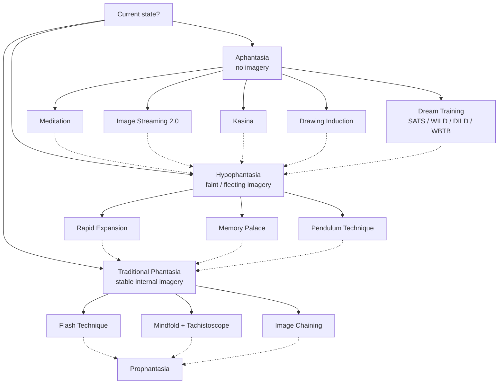
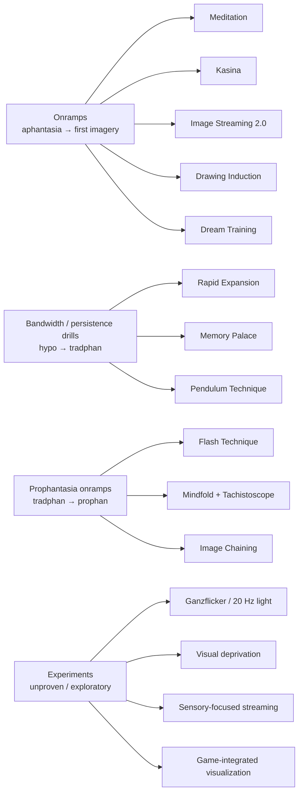

# Techniques

This file collects the named methods, drills, and experiments the r/CureAphantasia community uses to train visualization. It is a practical reference, not a medical protocol. Nothing here is a guaranteed cure — the community consensus is that slow, consistent, relaxed practice beats intense bursts, and that progress is highly variable across people. Some practitioners see waking-state gains in weeks; others mainly see dream-vividness changes first; some report years of plateau before breakthrough. Pace accordingly.

The decision tree below is a rough map of where people tend to start based on their current visualization baseline. Cross-apply freely — almost every technique has reported use outside its primary bucket.

_Dotted arrows indicate the typical next state that each technique is reported to move people toward. Solid arrows are entry points._

A second diagram shows how techniques group by function:

----

## General principles

A small number of patterns recur across almost every successful practitioner report. Start here before reaching for a specific named technique.

• **Short, daily, consistent sessions** — Most reported progress comes from 10–30 minute daily sessions sustained over months, not from multi-hour weekend bursts.

• **Relaxation over effort** — Tension actively suppresses visualization output. Anxiety blocks it entirely. _If you are straining, you are probably not training._

• **Eye closure and mindfolds** — Many practitioners use a mindfold (blackout blindfold) or practice in a dark room. Reducing external visual input makes faint internal imagery detectable.

• **Curiosity over force** — "What is there?" beats "Make something appear." The second prompt reliably stalls; the first invites whatever signal is already present.

• **Crawl before walking** — Consolidate small wins (e.g., recognizing visual vs. verbal thought) before attempting full scenes.

• **Bandwidth grows before vividness** — You will probably be able to hold more properties simultaneously before any one property becomes clear. This is normal.

• **Multi-sensory grounding** — Practice is more effective when it recruits touch, sound, spatial awareness, and kinesthesia alongside vision. Touch alone breaks into pressure, temperature, texture, and pain as trainable sub-senses.

• **Dream-vividness is an early marker** — Dream recall and dream clarity typically improve before waking imagery does. Use this as a leading indicator.

• **Track it** — Practitioners who keep detailed journals correlate with eventual breakthrough. Writing helps both motivation and pattern recognition across plateaus.

• **Plateaus are normal** — Weeks of no apparent change are typical. Obsessing over timeline is one of the most common demotivators. Variability across individuals is enormous.

----

## Onramps: aphantasia → some imagery

For people starting from complete or near-complete absence of imagery. The goal at this stage is to detect *any* internal visual signal — an afterimage, a flicker of shape, a brief color — and to build the relaxed, low-effort states in which that signal is findable.

• **Meditation** – Foundational mental training. Develops concentration, quiets the inner monologue, and opens access to sensory (non-verbal) thinking. Forms discussed in the community: mindfulness, breath-counting, mantra (e.g., om), eyes-open object meditation, and long silent retreats such as Vipassana. Meditation is treated as conditioning for attention bandwidth rather than a goal in itself. Aphants are often reported to have a meditation advantage — fewer visual distractions to settle. Expect alpha/theta state induction, which is the same relaxed state that facilitates spontaneous imagery.

• **Kasina** – Sustained attention on a single visual object (a colored disc, a candle flame, a uniform color field). The flame or disc provides a high-contrast stimulus with long afterimage persistence. Stare for several minutes with eyes open; close eyes; attend to the afterimage, phosphenes, and emerging noise. Reliably produces trance states and — at advanced stages — spontaneous detailed internal imagery, sometimes at hyperphantasia-level vividness. _Synesthetic phenomena are frequently reported in extended sessions; this is expected, not a warning sign on its own._

• **Image Streaming 2.0** – An aphantasia-adapted variant of classic image streaming. Instead of describing objects ("a lamp"), describe sensory qualities ("warm glow, round shade, tapered stem"). Narrate aloud or subvocalize whatever fleeting imagery appears — shape, color, value, saturation, shadow, texture, sound, touch, taste. The narration stabilizes otherwise-transient content. Cognitively intensive; not sustainable for long sessions. Works best in relaxed theta/alpha states. _Without prior access to any sensory thinking, the exercise can collapse into pure verbal confabulation — in that case, meditation or kasina first._

• **Drawing Induction** – Mentally imagine a pencil and paper. Draw an object one line at a time, asking yourself "what shape would I draw next?" The shape-question prompts sensory (not verbal) retrieval — the answer arrives as visual content. With repetition, the pencil and paper drop away, leaving the visual thinking itself. Works because "plan to draw X" is a more concrete prompt than "visualize X" and naturally recruits spatial and shape reasoning. A kinesthetic cousin: imagine denting a Coca-Cola can from different angles while attending to how the deformation looks.

• **Dream Training** – A bundle of techniques borrowed from the lucid-dreaming community. Dreams are typically the easiest place to access vivid imagery, so increasing dream recall and dream-vividness is often an earlier achievable goal than waking visualization.
  - **Dream journaling** – Write down dreams on waking; strengthens recall and gradually improves dream-vividness.
  - **Reality checks** – Daytime habit of testing perception (can I push my finger through my palm?) that transfers into dream awareness.
  - **WBTB (Wake-Back-To-Bed)** – Wake ~5 hours into sleep, stay up briefly, return to sleep. Shifts the next sleep period toward more REM and more lucid opportunity.
  - **WILD (Wake-Initiated Lucid Dream)** – Transition directly from waking into lucid dream, usually via sustained attention on hypnagogic imagery through sleep onset.
  - **DILD (Dream-Initiated Lucid Dream)** – Become lucid inside an already-running dream via trained reality checks.
  - **SATS (State Akin to Sleep)** – Borrowed from Neville Goddard. Deliberately drop into near-sleep while holding an intended visualization; the held content seeds dream material.

----

## Bandwidth and persistence drills: hypophantasia → traditional phantasia

For people who have some imagery — fleeting, faint, fragmented — and need to stabilize it, hold it longer, and hold more of it at once. "Bandwidth" means the number of visual properties (color + shape + motion + depth + texture…) that can be held simultaneously; "persistence" means how long imagery stays before collapsing.

• **Rapid Expansion** – Tradphan-specific bandwidth drill. Pick a well-known visual target (often a character from a show you have strong visual memory of). Visualize them. Then rapidly shift your mental gaze across different properties of the character — color, shape, outline, specific feature, posture — while sustaining the visualization. _Counterintuitively, rapid cycling produces more stable simultaneous imagery than steady staring, because steady focus collapses to one property at a time._ Requires a baseline of tradphan ability; not for early-stage aphants.

• **Memory Palace / Method of Loci** – Use spatial memory of a familiar location (childhood home, daily commute, specific building) as scaffolding. Pick a location; start at the entrance; move slowly, visualizing one room or area at a time — furniture, lighting, textures, objects, spatial layout. Return daily and push to add detail. The narrative structure of the walk pulls attention forward and distributes cognitive load, producing longer-held imagery than staring at a single isolated object. Rooms require holding multiple objects, textures, and spatial relations at once, which directly trains bandwidth. Once a palace is established, it becomes a stable testbed for new skills — adding motion, lighting changes, color shifts.

• **Pendulum Technique** – Background-visualization drill. Pick a simple shape (a swinging sphere works). Hold the visualization in the background of everyday activity; evolve it over time — color shifts (gold to emerald), size changes, trailing patterns in sand, swing arc variation. _Requires an existing tradphan baseline — early aphants cannot hold a background pendulum because there is nothing to sustain._ A mid-stage technique, not an onramp. The reported benefit is shifting visualization training from effortful session work to autopilot practice, with constant presence building persistence by default and subconscious integration generalizing to other imagery.

• **Daily Recall Exercise** – Each evening, retrace the day visually from waking: lighting, clothing, textures, events. Low-setup and high-yield; doubles as a memory-palace variant using your own day as the space.

• **Image Memorization** – Study a reference image for 1 minute; close eyes; reconstruct for at least 4 minutes; repeat daily.

• **Cartoon / animation recall** – Recreate scenes from flat-graphic media. Reported as easier for beginners than photorealistic reference.

• **Rapid component switching** – Move to the next visualization target as soon as "good enough" is reached; avoids over-dwelling and trains throughput.

----

## Prophantasia onramps: traditional phantasia → prophantasia

For people with stable internal imagery who want to extend it into projected visuals — imagery perceived as "out there" in external space rather than confined to the mind's eye. This tier relies heavily on afterimages and on blocking competing ocular input.

• **Flash Technique** – Foundational prophantasia drill, built on natural palinopsia (afterimages).
  1. Pick a target — saturated colored paper works best. _Screens add secondary afterimages; avoid them._
  2. Stare for about 1 second.
  3. Snap eyes shut, or look away to a neutral surface.
  4. Observe the residual signal — the afterimage.
  5. Try to revive or extend it; hold it longer than it naturally would persist.
  6. Rotate between colors and objects on subsequent passes to prevent cone fatigue.

  Typical arc: days 1–7 are very faint, near-colorless, fractions of a second. With weeks of practice, 2–3 second stable afterimages become achievable. Advanced practitioners report controllable, true-color (photographic, not inverted) afterimages that can be moved and manipulated with mental gaze.

• **Candle Flash variant** – Flame substitutes for paper; the residual is brighter and lasts longer. Direct descendant of kasina practice.

• **Mindfold + Tachistoscope** – A 1960s–70s apparatus, still in community use. Blindfold plus rapid-flash device produces non-inverting afterimages in a controlled dark field. Useful for practitioners whose normal afterimages come back inverted (complementary color) rather than true-color.

• **Image Chaining** – Sequential targets linked so the residual of target N becomes the starting point for imagining target N+1. Trains voluntary transformation of afterimage content.

_Cautions: eye strain is the primary risk. Rotate targets and rest between sessions. Do not confuse inverted (cone-fatigue / negative) afterimages with a successful training signal — a true-color afterimage is the goal of advanced practice, not the automatic output._

----

## Supporting techniques

Cross-cutting methods that do not fit cleanly in any one tier but are frequently mentioned.

• **Tapping Technique** – Gentle forehead tap paired with a mental gaze shift to the tap location. Helps retain focus during hypophantasia sessions when attention drifts.

• **Emoji-based visual thinking** – Contemplate specific emojis throughout the day. Trains consistent color and form reference without verbal labels.

• **Kinematic motion training** – Visualize continuous motion (stirring a pot, bouncing a ball, parallel parking). Bridges sequential and persistent visual thought — motion forces frame-to-frame continuity.

• **Modification-via-sensory-thought** – Visualize an object, then ask "how would it look modified?" and think the answer sensorially rather than verbally. Trains volitional manipulation.

• **Dual-focus training** – Split attention between the mental screen (brightness and persistence) and sensory thought (detail). Reported as a plateau-breaker: the combined load compounds vividness in a way that neither alone produces.

• **Audio-guided list playback** – Text-to-speech of a 100+ visualizable-object list; practice visualization while listening.

• **Autogogia spatial alignment** – Meditate on 3D spatial awareness of your body "in a realm of particles." Transition the sensory map into projected imagery.

----

## Experiments

Less-standardized trials. Framed explicitly as testing rather than proven practice. Results vary; inclusion here is descriptive, not an endorsement.

• **Ganzflicker / high-frequency light exposure** – Stare at flickering light around 20 Hz to stimulate visual cortex. Anecdotal gains; some practitioners report increased hypnagogic sensitivity afterward. _Use caution if you have any photosensitive seizure history. Rest if visual noise persists after the session ends._

• **Ganzfeld** – Uniform, unstructured visual field (often half ping-pong balls over the eyes with diffuse light). Sensory-reduction technique; produces emergent imagery in many subjects.

• **Visual deprivation training** – About 1 hour in darkness to increase cortex sensitivity. Simple and low-risk.

• **Sensory-focused image streaming** – Variant emphasizing shape, form, color, value, saturation, shadow, and non-visual senses, while minimizing analytical labels. Cognitively intensive; reported as a capacity-expander for practitioners who have plateaued on classic streaming.

• **Letter / word image streaming** – Visualize letters or words rather than objects. Similar to number-visualization approaches.

• **Game-integrated visualization** – Visualize alongside familiar gameplay. Tests whether gaming interferes with or aids training; reports are mixed.

• **Prophantasia session training** – Dedicated audio-guided (sleepstory-style) prophantasia practice in a relaxed state.

• **Tachistoscope** – Covered under Prophantasia Onramps; also used experimentally with novel stimuli.

A common observation across experiments: hypnagogic sensitivity increases, drowsy states produce stronger emergent imagery, and combining visualization with unrelated tasks (movement, humming, math) makes the capacity more robust.

----

## Progress expectations

Realistic framing from the corpus. Timescales vary enormously — these are typical shapes, not promises.

**Stage pattern reported across practitioners:**

1. **Aphantasia** – complete absence.
2. **Hypophantasia** – vague flashes, sub-second sensory impressions, first afterimage-from-recall.
3. **Early traditional phantasia** – sustained but low-clarity visuals; dream vividness rises.
4. **Capacity expansion** – multiple visual properties held simultaneously (color + shape + motion + depth).
5. **Plateau** – prolonged stasis; requires technique adjustment.
6. **Dual-focus breakthrough** – split attention between screen and sensory-thought unlocks compound gains.
7. **Standard phantasia** – clear, stable, persistent imagery with volitional modification.
8. **Prophantasia mastery** – sustained projection of complex scenes.
9. **Hyperphantasia** – vividness approaching or exceeding perception; synesthetic phenomena.

**Observed invariants:**

• **Non-linear progress** – Weeks of no apparent change are normal. Breakthroughs often follow plateaus abruptly.

• **Bandwidth before vividness** – You will probably hold more properties before any one gets sharper.

• **Dream markers lead** – Dream recall and dream vividness improve before waking imagery. Treat dream journaling as a progress tracker, not just a separate practice.

• **Journaling correlates with breakthrough** – Detailed written tracking (e.g., the long-form logs by community members like apps4life and devwizard_35359) correlates with eventual success. _Cause vs. effect is unclear, but the pattern is consistent._

• **Timeline anxiety is the most common demotivator** – Comparing your arc to others is almost always counterproductive.

**Common block patterns:**

• Over-reliance on verbal or analogue thinking during attempts.

• Trying to force vividness before capacity has grown.

• Practicing in visual isolation rather than multi-sensorially.

• Anxiety and effort tension suppressing access to the relaxed states that visualization needs.

**Warnings:**

• **Overtraining** – Cognitive fatigue is real. Prophantasia and streaming work are mentally expensive; rest days matter.

• **HPPD-like risk** – Aggressive prophantasia and autogogia work carries a small reported risk of persistent visual snow or similar lingering phenomena. Most practitioners do not experience this, but pace your work and stop if unwanted perceptual effects persist between sessions.

• **Intrusive imagery** – As visual capacity returns, suppressed intrusive or distressing imagery sometimes surfaces. This is a documented pattern. Slow down, ground with non-visual senses, and seek support if it becomes persistent or disruptive.

• **Eye strain** – Especially in flash-technique work. Rotate targets, rest, avoid screens as stimulus sources.

----

## Support

Visualization training is easier with company. Community resources and framings that practitioners return to most often:

• **r/CureAphantasia** – The primary Reddit community; hosts guides, progress logs, and technique discussion.

• **apps4life's training PSAs** – Community-maintained write-ups on sensory-descriptor tools (fruit/vegetable prompts for autogogia induction, among others).

• **devwizard_35359's long-form progress documentation** – Detailed multi-month practice journals; useful as a realistic timeline reference.

• **Imagination Superguide** – Community resource built around the "sensation of seeing" framing — treating imagery as a thing one senses rather than a thing one produces.

**What helps:**

• Relaxation before any session. Tension decreases prophantasia output. Anxiety blocks visualization.
• Consolidating small wins. Recognizing visual vs. verbal thought is itself a milestone.
• Pacing around emotional safety. Intrusive imagery can surface; slow practice if so.
• Training touch as four sub-senses (pressure, temperature, texture, pain). Each is independently trainable and contributes to immersive imagination.
• Treating spatial properties (where things are, body-in-space) as co-equal with visual ones. Kinesthetic grounding stabilizes visual content.

**What to avoid:**

• Forcing vividness. It does not work, and it builds the effort-tension habit that will block you later.
• Comparing your arc to anyone else's. Variability is enormous.
• Practicing through exhaustion. Rest days beat streaks.
• Aggressive stimulus protocols without rest. If flicker work or flash work leaves visual noise that persists into the next day, back off.

_This file is a living summary. Techniques, categories, and progress markers here reflect community experience as recorded in the research corpus — they are not clinical protocols, and individual results vary widely. If something is working for you, keep going. If something is making you worse, stop._
